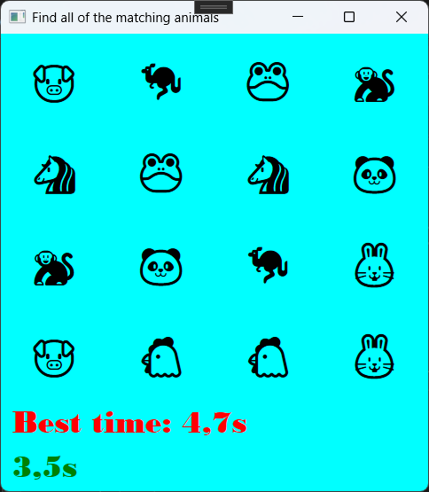

Animal Match Game

Um divertido e simples jogo da memória (Match Game) construído com WPF e C#. O objetivo é encontrar todos os pares de animais correspondentes no menor tempo possível e tentar bater seu próprio recorde.

-Visão Geral:
Tela principal do jogo com o grid de animais.

Tela de vitória com o tempo final e a opção de recomeçar.

Funcionalidades
Jogabilidade Clássica: A clássica mecânica de jogo da memória que todos conhecem e amam.

Grid 4x4: Um desafio com 16 cartas, contendo 8 pares de animais diferentes.

Cronômetro em Tempo Real: Um cronômetro que inicia assim que o jogo começa, para acompanhar seu progresso.

Música (no copyright) enquanto o jogo estiver em andamento.

Recorde de Melhor Tempo: O jogo salva e exibe seu melhor tempo, incentivando você a jogar novamente para superar seu recorde.

Interface Simples e Colorida: Uma interface visualmente agradável e fácil de entender.

Opção de Reiniciar: Após vencer, um botão "Start Over" aparece para que você possa jogar novamente.

Como Jogar
Execute o aplicativo para iniciar um novo jogo. O cronômetro começará imediatamente.

Clique em dois cartões para virá-los e revelar os animais.

Se os animais forem um par, eles desaparecerão do tabuleiro.

Se não forem um par, eles serão virados de volta.

Continue o processo até que todos os pares tenham sido encontrados e o tabuleiro esteja limpo.

Ao final, seu tempo será exibido. Tente bater o "Best time"!

Clique em Start Over para iniciar uma nova partida.

Tecnologias Utilizadas
Linguagem: C#

Framework: WPF (Windows Presentation Foundation)

Interface: XAML

Como Contribuir
Se você tiver ideias para melhorar o jogo, sinta-se à vontade para criar um fork do repositório e abrir um pull request. Algumas ideias para futuras melhorias:

[ ] Adicionar níveis de dificuldade (grids maiores, como 6x6).

[ ] Incluir efeitos sonoros ao virar as cartas e ao vencer.

[ ] Adicionar animações para o flip das cartas.

[ ] Criar uma tela de menu inicial.

[ ] Permitir a escolha de diferentes temas para as cartas (frutas, veículos, etc.).
